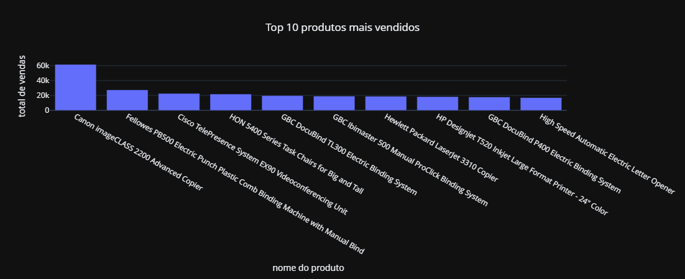
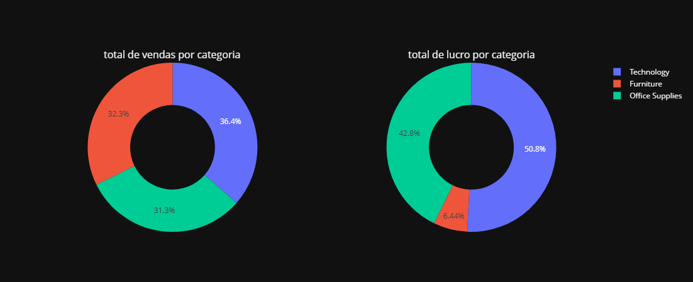
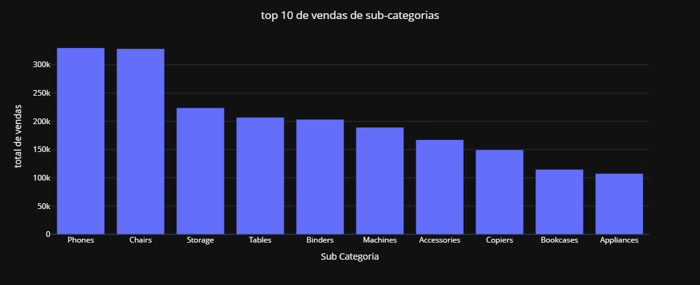
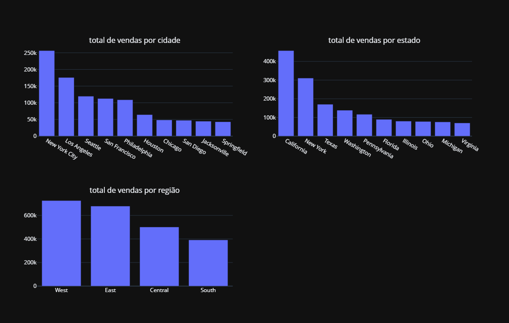

# 📊 Superstore Dataset – Análise Exploratória


Este projeto realiza uma **análise exploratória de dados (EDA)** utilizando o **Superstore Dataset**, que contém informações sobre vendas, lucros e clientes de uma rede de supermercados fictícia.

🎯 **Objetivo:** Identificar **produtos, categorias, regiões e clientes mais lucrativos**, além de oportunidades de otimização nas vendas.

🔗 **Fonte dos dados:** [Kaggle – Superstore Dataset](https://www.kaggle.com/datasets/vivek468/superstore-dataset-final)

📓 **Notebook completo:** [Clique aqui para visualizar](MAIN.IPYNB)

---

## 🛠 Tecnologias Utilizadas
- Python 3.9+
- Pandas (manipulação de dados)
- plotly (visualização de dados)
- Jupyter Notebook
- Git/GitHub para versionamento

---

## 🔍 Metodologia da Análise

1️⃣ **Importação e exploração inicial dos dados** (`.head()`, `.info()`, `.describe()`)  
2️⃣ **Tratamento de dados com valores errados e valores nulos**  
3️⃣ **Análise exploratória com visualizações**  

---

## 📈 Principais Insights

✅ **Tecnologia** é a categoria mais lucrativa.  
✅ **Móveis** têm vendas altas, mas margens muito baixas.  
✅ **Telefones e Cadeiras** são os produtos mais vendidos.  
✅ **Nova York e Los Angeles** lideram em vendas entre as cidades.  
✅ **Califórnia** é o estado com maior volume de vendas.

---

## 📊 Visualizações e Análises

### 🔝 1. Top 10 Produtos Mais Vendidos


📌 Observa-se que o produto mais vendido possui um volume de vendas significativamente superior aos demais, possivelmente devido a:
- Alta demanda e utilidade recorrente
- Campanhas promocionais e marketing direcionado
- Disponibilidade em estoque e logística eficiente

---

### 💰 2. Total de Vendas e Lucro


📌 Apesar de **vendas semelhantes entre categorias**, a **Tecnologia** apresenta maior margem de lucro, enquanto **Móveis** têm baixa lucratividade, possivelmente por:
- Custos elevados de aquisição/produção
- Preços de venda baixos
- Muitos descontos aplicados
- Custos logísticos ou devoluções frequentes

---

### 📦 3. Top 10 Vendas por Subcategorias


📌 Telefones e Cadeiras se destacam nas vendas. Entretanto, a baixa margem de lucro da categoria **Móveis** sugere necessidade de revisão de precificação e custos.

---

### 🗺️ 4. Vendas por Localidade


📌 **Nova York e Los Angeles** são as cidades mais lucrativas.  
📌 A **Califórnia** concentra as maiores vendas estaduais, seguida por Nova York.  
📌 Três cidades californianas aparecem no Top 10 (Los Angeles, San Francisco e San Diego).

---

## ✅ Conclusões e Recomendações

📌 Focar investimentos na **categoria Tecnologia**, que apresenta maior rentabilidade.  
📌 Revisar estratégia de preços e custos para **Móveis**, que possuem baixa margem mesmo com boas vendas.  
📌 **Nova York, Los Angeles e Califórnia** são regiões estratégicas e devem receber maior atenção em campanhas de marketing e logística.

---

## 🔮 Próximos Passos

🔹 Criar **modelos de previsão de vendas** (Regressão).  
🔹 Realizar **segmentação de clientes** (Clusterização).  
🔹 Analisar **sazonalidade e tendências de vendas** ao longo do tempo.  

---

## 🚀 Como Executar o Projeto

```bash
# 1️⃣ Clonar o repositório
git clone https://github.com/CiroKyushima/Superstore-Dataset-uma-analise-grafica.git

# 2️⃣ Instalar as dependências
pip install -r requirements.txt

# 3️⃣ Abrir o Jupyter Notebook
jupyter notebook MAIN.IPYNB
