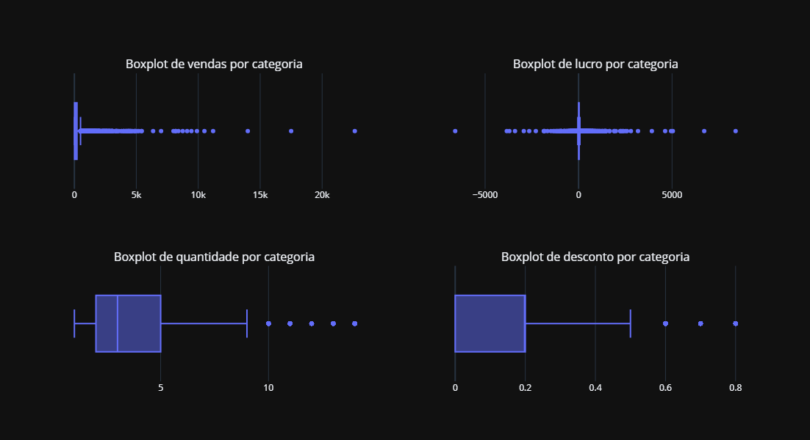

# Superstore-Dataset---Power-BI
## introdução:
Contexto: Com a crescente demanda e a competição acirrada no mercado, uma gigante do setor de supermercados busca seu conhecimento para entender o que funciona melhor para ela. Ela gostaria de entender quais produtos, regiões, categorias e segmentos de clientes devem ser alvo ou evitados. 
Objetivo: analisar quais os produtos, regiões, categorias, sub-categorias, dias, anos e meses que estão dando maior lucratividade; 

a base de dados esta disponivel no Kaggle: https://www.kaggle.com/datasets/vivek468/superstore-dataset-final 

para o codigo python, utilizei as bibliotecas pandas, numpy, matplotlib, seaborn.
no codigo disponivel, utilizo as bibliotecas os e zipfile para baixar os dados e descompactar eles de forma organizada.
a base de dados apresenta 9994 linhas com 21 colunas e pelas analises, o dataset não apresenta problemas que impactem na analise.
embora ainda tenham outliers como segue o grafico abaixo:
 

## Analise dos Gráficos:
### 1 - TOP 10 produtos mais vendidos:

O gráfico acima apresenta os 10 produtos mais vendidos na empresa. estranhamente, o produto mais vendido apresenta um valor de venda muito alto em relação aos outros. 
esse alto valor de vendas pode ser explicado pelos seguinte fatores:
  - Alta demanda e utilidade recorrente;
  - Campanhas promocionais e marketing direcionado;
  - Disponibilidade em estoque e logística eficiente;
  -  Reputação e confiabilidade do produto;
  -  Falta de variedade entre os produtos secundários;

a loja em analise, apresenta 3 categorias sendo, tecnologia, suprimentos e moveis. de acordo com o gráfico os produtos mais vendidos são de categoria suprimento seguindo de tecnologia e por ultimo moveis.
pela analise de vendas, podemos impor que empresas são as maiores clientes desse super mercado.

### 2 - total de vendas e lucro:

no Grafico acima, demonstra que as 3 categorias de produtos são bastante proximos em vendas, com tecnologia com apenas 3 a 4% maior em relação as duas categorias. o segundo grafico demonstra que a maior lucratividade esta vindo tambem da categoria de tecnologia, sinal que esse é o setor mais rentavel. interessante perceber que a categoria de móveis ainda sendo maior em vendas que a de suprimentos, ele apresenta uma lucratividade extremamente baixa, o que pode ser um motivo de preocupação. talvez pelos motivos abaixo:
  - Os custos de aquisição/produção são muito altos
  - O preço de venda é muito baixo
  - Há muitos descontos aplicados
  - Existem muitos custos com logística ou devoluções

### 3 - TOP 10 de vendas por sub categorias

analisando o grafico acima, notamos que a venda de telefones e cadeiras são bem proximas e tambem com um destaque em relação aos outros produtos. porem, a baixa lucratividade da categoria de móveis demonstra que tem algo extremamente problematico com a venda dessa categoria, no grafico acima, o segundo maior em vendas pertence aos moveis e ainda há 3 produtos nessa lista, apresentando 2 produtos a mais em relação a categoria de suprimentos. 

### 4 - vendas por localidade:

to be continued... ksksksks futuramente escreverei sobre essas analises
desenvolverei um DashBoard com Power BI para compreender melhor o motivo dessa baixa lucratividade;
